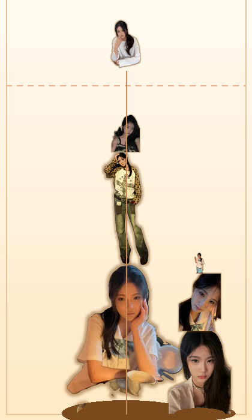

# 合成大贾许然飞

纯 **HTML + CSS + JavaScript** 的静态网页小游戏，零依赖、零构建、离线可玩。
物理引擎（PBD 位置约束求解）是自己写的，没有引入 matter.js 等任何第三方库。

> **换皮说明**：这是 [YHSome/BigNaiWa](https://github.com/YHSome/BigNaiWa)（原名「合成大奶娃」）的二次修改版，
> 把 11 级水果贴图换成了同一个人的 11 张照片。玩法、物理、渲染都沿用原项目（排行榜、赞助弹窗已移除），
> 换皮流程见下面的「素材（换图）」。下文沿用原项目的叫法，把合成链上的每一级统称为「水果」（实际显示的是人像）。

## 🎮 在线玩

**<https://kobe824-248.github.io/jxrf/>**

（GitHub Pages 托管，手机浏览器打开就能玩，也可以「添加到主屏幕」当 App 用。）



## 玩法

- **鼠标**：移动瞄准，点击即投放。
- **触屏**：按住拖动瞄准，**松手才投放**——手指不会挡住落点，也方便微调。
- 棋盘右上角的「下一个」是**下一颗**；当前这颗画在准星位置（虚线顶端）。
  投放后的冷却期间当前这颗会**变淡**显示（还不能投），这样两个位置始终各是各的，不会看混。
- 两个**同级别**的碰到一起就合成为高一级，并获得分数。
- 顶上虚线是**警戒线**：有水果**卡在线的上方并且基本停住**、累计超过 1.5 秒即判负
  （被弹起来飞过线的不算，详见下面的「失败规则」）。
- `←` `→` 微调位置，`Space` / `Enter` 投放，`R` 重新开始。
  （结束后空格/回车不再重开，避免手快连开新局。）

合成链（11 级）：

```
迷你贾许然飞 → 小贾许然飞 → 贾许然飞 → 大贾许然飞 → 巨贾许然飞 → 贾许然飞哥 → 贾许然飞王 → 超级贾许然飞 → 究极贾许然飞 → 半神贾许然飞 → 神贾许然飞
```

合成得分采用三角数：1 / 3 / 6 / 10 / 15 / 21 / 28 / 36 / 45 / 55，
两只神贾许然飞撞在一起会一起炸掉，额外加 500 分、并送一枚复活币（后期唯一的泄压阀：两只神贾许然飞占满棋盘，不炸掉就没法继续玩）。

## 失败规则

**唯一判负条件：有水果卡在警戒线上方、且基本停住，累计超过 1.5 秒。**

```js
const DANGER_Y   = 142;   // 警戒线
const OVER_LIMIT = 1.5;   // 累计秒数
const REST_SPEED = 140;   // 低于这个速度才算“卡住了”（px/s）

for (const b of balls) {
  if (b.dead || !b.landed) continue;         // 还没落地的不算
  if (b.y - b.r < DANGER_Y) {                // 这只在线上面
    if (b.vx*b.vx + b.vy*b.vy < REST_SPEED2) {
      b.overTime += dt;                      // 停住的才计时
      if (b.overTime > OVER_LIMIT) gameOver();
    } else {
      b.overTime -= dt * 2;                  // 正在飞 → 倒扣
    }
  } else {
    b.overTime -= dt * 2;                    // 回到线下方 → 倒扣（2 倍速）
  }
}
```

几个容易被误解的点：

| 疑问 | 答案 |
| --- | --- |
| **好几只轮流在线上方，时间会加在一起吗？** | **不会。** `overTime` 是**每只各自**的变量，必须**同一只**累计满 1.5 秒 |
| **被弹飞、路过线上的算吗？** | **不算。** 速度 ≥ 140px/s 时不计时，而且还在倒扣 |
| **贴着线上下反复弹会攒起来吗？** | 得看比例：线下方按 2 倍速扣，净变化率 = `3f − 2`（`f` = 在线上方的时间占比），**只有 f > 2/3 才攒得起来** |
| **会不会永远输不了？** | 不会。实测灌满棋盘第 161 次投放判负，那时堆顶 y=45、线上方 4 只里 3 只是静止的 |
| **除了这个还有别的失败条件吗？** | 没有。不限步数、不限数量、不限时间 |

想调：`DANGER_Y` 调高低、`OVER_LIMIT` 调容忍时间、`REST_SPEED` 调“多慢才算卡住”。
`node physics.test.js` 的第 7 组会把这三条规则各验一遍。

## 运行

线上直接开 <https://yhsome.github.io/BigNaiWa/>；
本地双击 `index.html` 即可（`file://` 协议下也能跑，排行榜已移除、全程不联网）。
线上：<https://kobe824-248.github.io/jxrf/>
也可以起个静态服务：

```bash
python -m http.server 8080
# 打开 http://localhost:8080
```

部署：仓库打开 **Settings → Pages → Source = Deploy from a branch → main / (root)** 即可，
根目录已经放了 `.nojekyll`，静态文件原样发布。
本项目已经部署在 <https://kobe824-248.github.io/jxrf/>，push 到 `main` 后会自动重建。

## 文件

| 文件 | 说明 |
| --- | --- |
| `index.html` | 页面结构：棋盘、结束遮罩、侧边面板 |
| `style.css` | 全部样式：玻璃拟态面板、响应式布局、结束动画 |
| `game.js` | 游戏逻辑 + 自研物理 + Canvas 渲染 + WebAudio 音效 |
| `assets/fruits/` | 贴图：`*.png` 是 512×512 的源图，页面实际加载的是 `*.webp`；另有 `parts.js` 碰撞形状、`blur.js` 极模糊占位图 |
| `tools/normalize_photos.py` | **本项目**的照片换皮脚本：AI 人像分割抠底 + 统一画布 |
| `tools/normalize_assets.py` | 原作者的素材统一脚本（物件图/单色底用）：区域生长抠底、去噪、烤暗边 |
| `tools/optimize_sprites.py` | 把源图压成 WebP 并裁到每级实际需要的尺寸（本项目实测 1.62 MB → 0.14 MB） |
| `tools/make_blur.py` | 生成极模糊占位图 `blur.js`（11 张缩略图拼成一条、内联成 data URL，约 6.6 KB） |
| `tools/build_parts.py` | 按贴图轮廓生成碰撞形状，产出 `assets/fruits/parts.js` |
| `src/` | 原始照片 11 张（命名 `1`~`11`），只作为脚本输入；`src/_orig/` 里是原作者水果素材的备份 |
| `physics.test.js` | 物理手感自检脚本（`node physics.test.js`） |
| `gameplay.test.js` | 复活 / 清场玩法自检（`node gameplay.test.js`） |
| `preview.png` | 预览图（用最终贴图渲染的效果示意图，不是浏览器截图） |

本地目录（都不进仓库，`_` 开头已由 `.gitignore` 忽略）：

| 目录 | 说明 |
| --- | --- |
| `.venv/` | 做素材用的 Python 环境（rembg / onnxruntime / opencv…），**游戏运行不需要它** |
| `src/_orig/`、`assets/fruits/_orig/` | 原作者水果素材的备份（随时可回到原版） |
| `_preview/` | 效果对比图（`final-look.png` 等） |

## 碰撞形状（不是圆）

**每个水果的碰撞箱按贴图轮廓来**：`tools/build_parts.py` 读 `assets/fruits/*.png` 的 alpha，
用一组**内接小圆**铺满轮廓，写出 `assets/fruits/parts.js`：

```js
window.SUIKA_PARTS = [ { rb: 1.083, parts: [[0.012,-0.31,0.42], ...] }, ... ];
// parts = [ox, oy, s]，单位是「以 r 为 1」；rb = 包围圆半径（快速粗筛用）
```

游戏里球的碰撞就是这些子圆：

| 环节 | 做法 |
| --- | --- |
| 粗筛 | 两个水果的包围圆 `rb` 不相交直接跳过 |
| 球球 | 子圆两两求交，取**最深/最近的那一对**产生法线与修正量，推力按逆质量分配到刚体中心 |
| 合成 | 任意一对子圆「贴上」（含 0.8px 容差）即合成 |
| 撞墙 | 每个子圆各自贴墙，取各方向最深穿透量一次性加到刚体中心上 |
| 旋转 | 子圆跟着刚体 `angle` 一起转，所以形状会随滚动改变落点 |

圆一律取**内接**（半径 = 到轮廓的欧氏距离，用 chamfer 距离变换算），
所以**不会出现"看不见的碰撞"**；覆盖率不够的地方再贪心补圆，覆盖率到 97% 就提前收工。

实测贴合度（IoU，1.0 = 与图片完全一致）：

原素材（水果，圆润饱满），`--max-parts 16`：

```
tier  0   1   2   3   4   5   6   7   8   9  10
IoU .94 .96 .95 .92 .85 .90 .81 .96 .94 .96 .78   ← 平均 0.91
超出轮廓 ≤1.2%（几乎为零）  圆个数 9~16（形状简单自动用更少）
```

本项目（人像，瘦长且四肢分离），`--grid 6 --max-parts 32`：

```
tier  0   1   2   3   4   5   6   7   8   9  10
IoU .84 .87 .78 .78 .76 .80 .74 .80 .72 .87 .86   ← 平均 0.80
覆盖率 72~87%   超出轮廓 ≤0.9%   圆个数 32（顶到上限）
```

`parts.js` 缺失或某级没数据时，自动退回成单圆（半径 r），行为与旧版一致，不会白屏。

重新生成（换了贴图之后跑一次）：

```bash
python tools/build_parts.py --grid 6 --max-parts 32 --preview
# --preview 会导出 _parts_preview.png：红=图片轮廓 绿=碰撞箱 黄=重合
```

成本：人像贴图的圆数从 9~16 涨到 **32**，实测 12~17 个球在场（384~544 个子圆）时整套物理每帧
**0.53~1.26 ms** —— 占 60fps 预算（16.7 ms）不到 8%。原素材在 12~30 个球时是 0.14~0.34 ms。

## 素材（换图）

11 级各对应 `assets/fruits/NN-<主题>.png` 一张，**棋盘、下一个预览、合成表、粒子全部复用同一张**，
不需要做多倍图（不同尺寸由 canvas 缩放）。页面实际加载的是同名 `.webp`。

规格：**正方形、透明底、主体居中占长边 92%**，贴图会跟着水果一起滚动/旋转。

这个主题用的是真人照片，所以抠底走 **AI 人像分割**——原作者那套「从四边向内区域生长 + 饱和度闸门」
只适合单色背景的产品图，拿生活照去跑会把整张照片都当成主体（桌椅、草地全留在里面）。

```bash
# 1) 把 11 张原始照片按 1..11 放进 src/（命名 1.jpg ~ 11.jpg，png/jpg/webp 混着也行）
python tools/normalize_photos.py        # 抠人像 + 统一 512×512、主体占 92%、烤暗边
python tools/optimize_sprites.py        # 压成 .webp（实测 1.6 MB → 0.14 MB）
python tools/build_parts.py --grid 6 --max-parts 32 --preview   # 按新轮廓重算碰撞形状
python tools/make_blur.py               # 重生成模糊占位图 blur.js

# 自检（两个都要过）
node physics.test.js
node gameplay.test.js
```

`tools/normalize_photos.py` 用 rembg 的 `u2net_human_seg` 做人像分割，抠完之后复用
`normalize_assets.py` 里的收尾逻辑（去噪、羽化、裁剪、长边 92%、烤暗边），产出规格和原项目一致。

依赖：

```bash
pip install rembg onnxruntime pillow numpy
```

首次运行会自动下载 `u2net_human_seg.onnx`（约 168 MB）到 `~/.u2net/`。
**国内直连 github.com 会超时**，可以先手动下好再跑：

```powershell
# Windows（先建目录，不然 curl 会报路径不存在）
New-Item -ItemType Directory -Force "$env:USERPROFILE\.u2net" | Out-Null
curl.exe -L -o "$env:USERPROFILE\.u2net\u2net_human_seg.onnx" `
  https://ghfast.top/https://github.com/danielgatis/rembg/releases/download/v0.0.0/u2net_human_seg.onnx
```

```bash
# macOS / Linux
mkdir -p ~/.u2net
curl -L -o ~/.u2net/u2net_human_seg.onnx \
  https://ghfast.top/https://github.com/danielgatis/rembg/releases/download/v0.0.0/u2net_human_seg.onnx
```

> **真人照片的碰撞形状比圆形水果难贴合**：`--grid 6 --max-parts 32` 下覆盖率 72~87%
> （原水果素材是 97%），换来的是「超出轮廓」仍 ≤0.9% —— 不会出现看不见的碰撞。
> 圆的数量从 9~16 涨到 32，物理每帧成本约 2~4 倍，仍远低于 60fps 的 16.7 ms 预算。
> 觉得手感还不够"实"，可以把 `--max-parts` 继续调大，或者改用头肩构图（形状更接近圆）。

**页面加载的是 `.webp`，`.png` 只是给工具用的源图。**

```bash
python tools/optimize_sprites.py            # 默认 q88，会打印每一张的体积对比
python tools/optimize_sprites.py --lossless # 想完全无损就用这个
```

原始照片放在 `src/`（只作为脚本输入，页面不读它）；原作者的水果素材备份在
`src/_orig/`、`assets/fruits/_orig/`（`_` 开头已被 `.gitignore` 忽略）。

**回退顺序是三级**，别让玩家看到"图挂了"：

1. 贴图到位 → 正常画
2. 还没到 / 失败了 → 画 `blur.js` 里那张**极模糊的同形状缩略图**（内联 data URL，零请求），
   观感是"图正在慢慢变清晰"
3. 连 `blur.js` 都没有（被拦了）→ 才画程序化的圆形水果

`game.js` 的 `loadSprites()` 对每张图**失败会退避重试 3 次**（弱网下一次拉不到很常见），
全部失败才回退，不影响玩。

**缺图不影响游玩**：任何一张加载失败都会自动回退成程序化绘制的圆形水果（`FRUITS[i].c1/c2`）。

## 用物件素材（比如换回水果）

改回单色背景的产品图/物件图时，可以直接用原作者那套：

1. **偷懒**：把新图命名成 `assets/fruits/NN-<主题>.png` 覆盖即可（脚本已经统一过格式）。
2. **正规**：把 11 张原始图按 `src/1..11.*` 放好，跑 `python tools/normalize_assets.py`，
   它会从四边向内**区域生长抠底**、丢掉零碎噪点、填掉主体内部小孔、
   裁剪并按长边 92% 居中到统一画布、最后在主体底下**烤一圈柔和暗边**。

三道闸门可按图切换（`tools/normalize_assets.py` 顶部 `CFG` 里逐张配置）：

| 闸门 | 作用 | 用在 |
| --- | --- | --- |
| `sat_max` | 饱和度高于它的像素永不算背景 | 浅底图 |
| `lum_min` | 亮度高于它的像素永不算背景（深底反向） | 星空底 |
| `val_min` | 最暗通道低于它的像素永不算背景 | "接近白但非纯白"的细节（例：白翅膀） |

## 实现要点

- **物理**：位置约束求解（PBD）。每帧 3 个子步 × 6 次迭代，
  每个水果带一组按图片轮廓生成的子圆（见上一节），
  速度由位置差反推 —— 堆叠稳定、不抖动，且能正确处理 124px 神贾许然飞压在 17px 葡萄上的极端质量比。
- **Q 弹回弹**：位置约束会把法向速度吃掉，所以在每个子步末尾额外做一次弹性冲量，
  把法向相对速度直接改写成 `e × 碰撞前速度`（球球 `e=0.38`、墙 `e=0.45`），
  回弹量只由 `e` 决定、不受子步/迭代次数影响。
  撞速低于 `REST_THRESHOLD` 时完全不弹，所以静止堆叠依然零抖动：
  从顶部掉落的水果能弹起约 110px、连弹 5 次才停。
  另外撞击时按法线做挤压变形（压扁 + 垂直拉伸，0.4 秒回弹），果冻感更强。
- **合成判定**：接触容差 0.8px，同级别贴身即合，手感跟手；
  合成只在每个子步的第 0 次迭代判定一次，避免重复合成。
- **渲染**：整体按 devicePixelRatio 缩放。有贴图就画贴图（`box = 2r / 0.92`，
  保证**视觉大小 = 物理直径**，四边不会露馅），没贴图就画程序化水果。
  贴图跟着 `b.angle` 一起旋转，和物理滚动一致；撞击时的挤压变形同样作用于贴图。
  合成时有粒子爆裂、飘分文字与新品弹出动画。
- **素材加载**：等 `img.decode()` 完成才交给 `drawImage`，避免画出没解码完的半成品。
- **音效**：WebAudio 振荡器实时合成，无音频文件；可一键静音并记忆设置。
- **存档**：最高分与静音状态存 `localStorage`。
- **调试**：控制台可用 `__DNW__.state`、`__DNW__.reset()`、`__DNW__.tryDrop()`、
  `__DNW__.FRUITS`、`__DNW__.revive`、`__DNW__.render()`。

## 物理自检

```bash
node physics.test.js
```

用桩件模拟 DOM/Canvas，在 Node 里跑真物理（连 `parts.js` 一起加载，用的是真实碰撞形状），覆盖：
自由落体回弹高度、球对球弹起、12 秒堆叠稳定性（残余速度 / 漂移 / 穿墙 / NaN）、
**静止后形状之间无穿透**、自动投放 60 次不走样、
触屏「拖动瞄准 / 松手投放」与鼠标「按下即投」两套输入、
**结束后空格/回车不再重开而 R 可以、输入框里不抢按键**（昵称输入框已随排行榜一起移除，这段是防御性保留）。

```bash
python tools/build_parts.py --grid 6 --max-parts 32 --preview   # 换了贴图后重新生成碰撞形状
node physics.test.js                                   # 物理自检
```

## 手机端适配

| 项 | 做法 |
| --- | --- |
| 布局 | 窄屏（≤860px）下 `.panel` 用 `order:-1` 提到棋盘上方，横过来压成**顶部信息条**：左边分数、右边按钮，标题/合成表/提示收起 |
| 棋盘尺寸 | `height: min(可用高度, 96vw × 700/420)`，宽度由 `aspect-ratio` 反推 —— 不拉伸、不溢出，任何机型都不出滚动条 |
| 视口高度 | 用 `100dvh`（带 `100vh` 回退），避开手机地址栏吃掉高度的问题 |
| 安全区 | `padding` 叠 `env(safe-area-inset-*)`，刘海 / 小白条不会压住内容 |
| 触控 | 棋盘 `touch-action:none`；`body` 上 `touch-action:manipulation` + `overscroll-behavior:none`，干掉双击缩放和下拉刷新 |
| 按钮 | 最小 46px 高、带内边距，小屏（≤380px）再压一档；`pointerdown` 时 `setPointerCapture`，手指滑出棋盘也能收到 `pointerup` |
| 反馈 | 合成时按等级给 `navigator.vibrate` 轻震（跟随静音开关） |
| 性能 | canvas 内部分辨率按 `devicePixelRatio` 缩放但**封顶 2×**，高分屏不炸填充率 |
| 弹窗 | 结束弹窗按钮撑满宽度、加大触摸目标 |

横屏（`orientation: landscape`）自动切回左右布局：棋盘占满高度、信息条竖排在右侧。

## 参数速查（`game.js` 顶部）

| 常量 | 默认值 | 作用 |
| --- | --- | --- |
| `GRAVITY` | `2600` | 重力加速度 px/s² |
| `SUBSTEPS` / `ITER` | `3` / `6` | 物理精度，调高更稳更费 CPU |
| `RESTITUTION` | `0.38` | 球与球之间的弹性，调大更弹 |
| `WALL_RESTITUTION` | `0.45` | 撞墙 / 撞地面的弹性 |
| `REST_THRESHOLD` | `55` | 撞速低于此值不反弹（保堆叠稳定） |
| `FRICTION` | `0.955` | 接触切向摩擦，调小更滑、调大更快停住 |
| `SQUASH_MAX` / `SQUASH_DECAY` | `0.30` / `9` | 撞击挤压的最大变形与回弹速度 |
| `DROP_MS` | `360` | 两次投放的最小间隔 |
| `OVER_LIMIT` | `1.5` | 越线判负秒数 |
| `DANGER_Y` | `142` | 警戒线高度 |
| `MERGE_PAD` | `0.8` | 合成接触容差（子圆之间） |
| `OVER_LIMIT` | `1.5` | 卡在警戒线上方多少秒判负 |
| `REST_SPEED` | `140` | 低于这个速度才算“卡住了”，飞过去的不计时 |
| `AVOID_REPEAT` | `true` | 「下一个」避开与当前相同的等级（改成 `false` 恢复完全随机，会有 ~22% 概率两边同图） |
| `SPAWN_WEIGHTS` | `[.28 .24 .20 .16 .12]` | 前 5 级的掉落权重；开了 `AVOID_REPEAT` 后实测摊平为 25.6/23.2/20.6/17.2/13.4% |
| `ASSET_FILL` | `0.92` | 贴图主体占画布比例，**必须与生成脚本的 `FILL` 一致** |
| `FRUITS` | 11 项 | 每级的半径 / 贴图路径 / 兜底配色，改这里即可换皮 |
| `FRUITS[i].c1/c2` | 11 组 | 贴图缺失时的程序化水果配色 |
| `FRUITS[i].pc1/pc2` | 11 组 | 粒子/汁水颜色（取自贴图主体平均色） |

## 参考的开源项目

本项目的玩法与水果链设计参考了以下开源实现（代码为本仓库原创，未复制其源码）：

- [Ikapricity/daxigua](https://github.com/Ikapricity/daxigua) — 合成大西瓜未修改版本源码，可直接在浏览器运行
- [CaptainAries/dxg](https://github.com/CaptainAries/dxg)
- [moonfloof/suika-game](https://github.com/moonfloof/suika-game) — 使用 matter.js 的英文版克隆
- [IceburgLettuce17/suika-game-js-beta](https://github.com/IceburgLettuce17/suika-game-js-beta)

## 许可与说明

- 上游项目 [YHSome/BigNaiWa](https://github.com/YHSome/BigNaiWa) 声明「仅供学习娱乐使用」，本项目沿用同样的定位。
- 11 级贴图来自同一个人的照片，**已获得本人同意**用于这个私人娱乐版本。仓库是 public 的，
  照片会公开可见 —— 想撤下就删仓库或关掉 Pages。
- 抠图用的 `u2net_human_seg.onnx` 随 [rembg](https://github.com/danielgatis/rembg)（MIT）发布；
  人脸检测用的 YuNet 来自 [opencv_zoo](https://github.com/opencv/opencv_zoo)（Apache-2.0）。
  两者都只在**制作素材**时用到，页面运行时不需要。
